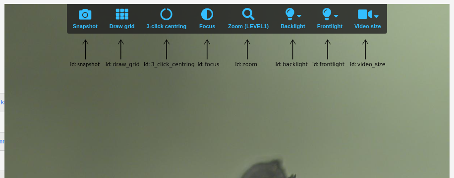
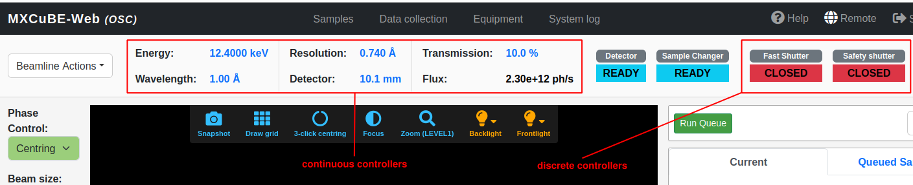
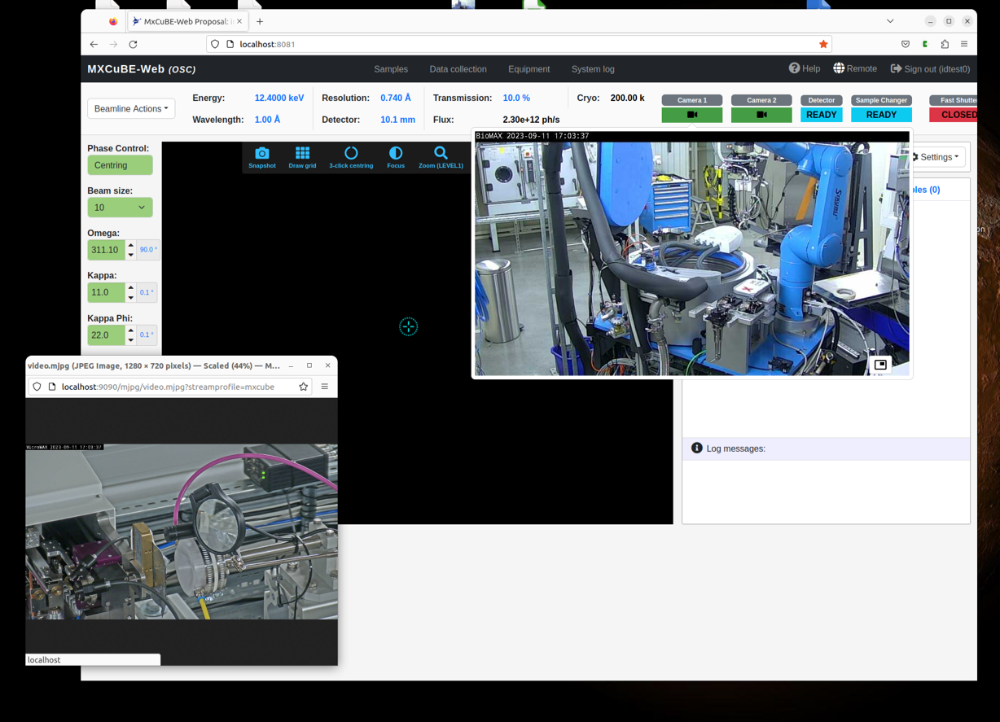

ui.yaml
=======

This configuration file allows customizing the UI to match the local beamline.
It allows configuring widgets for controlling gonio motors, on-axis sample viewer, hutch video streams and more.
The ``ui.yaml`` contains following sections:

* sample_view_
* sample_view_video_controls_
* beamline_setup_
* camera_setup_

Each section groups settings for related UI features.
See below an `example  ui.yaml <ui_yaml_example_>`_ file.

sample_view
-----------

This section configures widgets for controlling gonio motors used for sample alignment.
The section has the following syntax:

.. code-block:: yaml

    sample_view:
      id: sample_view
      components:
        - label: <motor_label>
          attribute: <beamline_attribute>
          role: <motor_role>
          step: <step_size>
          precision: <value_precision>
          suffix: <value_suffix>


The ``components`` key contains a list of gonio motor specifications.
Each motor specification have the following keys:

+-----------+-------------------------------------+
| key       | purpose                             |
+===========+=====================================+
| attribute | motor's beamline attribute id       |
+-----------+-------------------------------------+
| role      | motor's sample movement role        |
+-----------+-------------------------------------+
| label     | widget's text label                 |
+-----------+-------------------------------------+
| step      | widget's single step size           |
+-----------+-------------------------------------+
| precision | widget's position display precision |
+-----------+-------------------------------------+
| suffix    | widget's position units suffix      |
+-----------+-------------------------------------+

The ``attribute`` key specifies the underlying motor's adapter object, via it's beamline attribute ID.
The ``role`` key specifies the physical move the motor performs on the sample.
For example, motor with the role *omega* rotates sample around the omega axis.

Common roles are:

* omega
* kappa
* kappa_phi
* phix
* phiy
* phiz
* sampx
* sampy
* sample_horizontal
* sample_vertical
* zoom
* focus

Here is an example of ``sample_view`` section:

.. code-block:: yaml

    sample_view:
      id: sample_view
      components:
        - label: Omega
          attribute: diffractometer.phi
          role: omega
          step: 90
          precision: 2
          suffix: °
        - label: Kappa
          attribute: diffractometer.kappa
          role: kappa
          step: 0.1
          precision: 1
          suffix: °

Above configures two rotational motors: omega and kappa.

sample_view_video_controls
--------------------------

This section configures sample view video widgets that should be included.
The section has the following syntax:

.. code-block:: yaml

    sample_view_video_controls:
      id: sample_view_video_controls
      components:
        - id: snapshot
          show: <show>
        - id: draw_grid
          show: <show>
          show_hspace: <show_hspace>
          show_vspace: <show_vspace>
        - id: 3_click_centring
          show: <show>
        - id: focus
          show: <show>
        - id: zoom
          show: <show>
        - id: backlight
          show: <show>
        - id: frontlight
          show: <show>
        - id: video_size
          show: <show>

It is a list of all supported sample video widgets.
``<show>`` flag is a boolean, when it's *true* the widget is included, when *false* it is omitted.
The `draw_grid` component also allows to enable setting horizontal and vertical spacing.



Above is the illustration of all supported widgets, with the IDs used by the MXCuBE.

beamline_setup
--------------

This section configures general beamline control widgets.
These widgets appear in the upper row on *Data collection* tab.



``beamline_setup`` supports two types of widgets, continuous value controllers and discrete state controllers.
Continuous value controller is for example a widget for beamline energy, which have range of valid energy levels.
Discrete state controllers, also known as N-state controllers, have a predefined number of valid states.
For example, fast shutter widget is such a controller, it has *open* and *closed* states.

The continuous widgets are rendered in the left-most post of the row.
The discrete widgets are placed to the right in the beamline setup row.

The section has the following syntax:

.. code-block:: yaml

    beamline_setup:
      id: beamline_setup
      components:
        - label: <UI label>
          attribute: <beamline_attribute>
          step: <step_size>
          precision: <value_precision>
          suffix: <value_suffix>

The ``components`` key contains a list of control widget specifications.
Each widget specification has the following keys:

+-----------+-------------------------------------+
| key       | purpose                             |
+===========+=====================================+
| attribute | hardware beamline attribute id      |
+-----------+-------------------------------------+
| label     | widget's text label                 |
+-----------+-------------------------------------+
| step      | widget's single step size           |
+-----------+-------------------------------------+
| precision | widget's position display precision |
+-----------+-------------------------------------+
| suffix    | widget's position units suffix      |
+-----------+-------------------------------------+

Note that the ``step``, ``precision``, and ``suffix`` keys are only used by continuous widgets and are omitted for discrete widgets.

Here is a short example of ``beamline_setup`` section:

.. code-block:: yaml

    beamline_setup:
      id: beamline_setup
      components:
        - label: Fast Shutter
          attribute: fast_shutter
        - label: Safety shutter
          attribute: safety_shutter
        - label: Energy
          attribute: energy
          step: 0.001
          precision: 4
          suffix: keV
        - label: Resolution
          attribute: resolution
          step: 0.001
          precision: 3
          suffix: Å

camera_setup
------------

Configures video stream widgets.
Each widget provides access to a video stream on the *Data collection* tab.
This is typically used for giving users an easy way to access hutch view cameras.
The section has the following syntax:

.. code-block:: yaml

    camera_setup:
      id: camera_setup
      components:
        - label: <UI label>
          attribute: <stream format>
          url: <video stream url>
          width: <width>
          height: <height>

The ``components`` key contains a list of video stream specifications.
Each stream specification has the following keys:

+-----------+---------------------+
| key       | purpose             |
+===========+=====================+
| label     | widget's text label |
+-----------+---------------------+
| attribute | stream format       |
+-----------+---------------------+
| url       | video stream's URL  |
+-----------+---------------------+
| width     | video window width  |
+-----------+---------------------+
| height    | video window height |
+-----------+---------------------+

The ``attribute`` specifies the video format.
If ``attribute`` is set to ``mp4``, the video will be rendered with the ``<video>`` HTML tag, otherwise the ```` tag is used.

Below is an example of a ``camera_setup`` section that configures two hutch view video streams.

.. code-block:: yaml

    camera_setup:
      id: camera_setup
      components:
        - label: Camera 1
          attribute: jpg
          url: http://localhost:8080/mjpg/video.mjpg?streamprofile=mxcube
          width: 800
          height: 450
        - label: Camera 2
          attribute: jpg
          url: http://localhost:9090/mjpg/video.mjpg?streamprofile=mxcube
          width: 800
          height: 450

The above configuration will result in the following UI setup:



Two video streams widgets are available in the upper right corner, with 'Camera 1' and 'Camera 2' labels.
By clicking on the camera icon, the video stream will be displayed.

.. _ui_yaml_example:

ui.yaml example
---------------

Below is an example of a UI configuration file ``ui.yaml``, as used by the mockup beamline.

.. literalinclude:: ../../../demo/mxcube-web/ui.yaml
   :language: yaml
