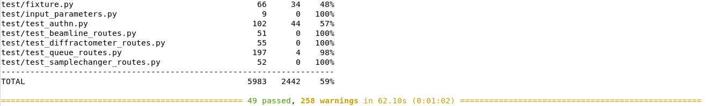

# Installing a development environment

MXCuBE-Web is the latest generation of the data acquisition software MXCuBE.
It is developed as a web application and runs in any recent browser.
The application is built using standard web technologies
and does not require any third-party plugins to be installed in order to function.
Being a web application, it is naturally divided into server and client parts.
The communication between the client and server are made using HTTP/HTTPS and web-sockets.
It is strongly recommended to use HTTPS, SSL/TLS encrypted HTTP.
The traffic passes through the conventional HTTP/HTTPS ports,
minimizing the need for special firewall or proxy settings to get the application to work.


## `HardwareRepository` and `mxcubecore`

The underlying beamline control layer
is implemented using the library [`mxcubecore`](https://github.com/mxcube/mxcubecore)
previously known as [`HardwareRepository`](https://github.com/mxcube/HardwareRepository).
The `mxcubecore` library is compatible with
both the MXCuBE-WEB and the [MXCuBE-Qt](https://github.com/mxcube/mxcubeqt) applications.

## Install with conda

We recommend using conda to create an isolated environment.
Conda can be downloaded [here](https://docs.conda.io/en/latest/miniconda.html#linux-installers).

### 1. Create a `mxcube` folder that will contain both `mxcubeweb` and `mxcubecore`

```
mkdir mxcube
cd mxcube
```

### 2. Clone `mxcubeweb` and `mxcubecore`

```
git clone https://github.com/mxcube/mxcubeweb.git
git clone https://github.com/mxcube/mxcubecore.git
```

### 3. Create the `mxcubeweb` conda environment

Create the `mxcubeweb` conda environment using the `conda-environment.yml` file in `mxcubeweb`.
The installation of the dependencies in the environment takes a few minutes.

The name of the environment is located at the top of the file `conda-environment.yml`.
It can be changed on the command line with `--name <env-name>`.

```
cd mxcubeweb
conda env create --file conda-environment.yml
# or (to pass a different name)
conda env create --file conda-environment.yml --name another_name
```

To switch to a specific Python version inside the conda environment,
one can additionally use a command such as the following after environment creation,
for example for Python 3.9:

```
conda install --name mxcubeweb 'python=3.9'
```

### 4. Activate the environment

```
conda activate mxcubeweb
```

### 5. Install the back-end dependencies

```
poetry install
```

(front-end)=

### 6. Install the front-end dependencies and build the UI

```
pnpm --prefix ui install
pnpm --prefix ui build
```

### 7. Running the application (server)

```
# The paths passed below need to be the absolute paths
# to the demo and build directories
# (that is why there is an extra `$(pwd)` in the command).
mxcubeweb-server -r $(pwd)/mxcubeweb/demo/ --static-folder $(pwd)/mxcubeweb/ui/build/ -L debug
```

_Running the above should give something similar to_


### 8. Running the MXCuBE-WEB front-end

All that is needed to run the application is to start the server
and point your browser to <http://localhost:8081>,
which will serve the prebuilt client (if any).

_The test username is `idtest0` and the password can be any string
(except `wrong` and `ispybDown`, those are used to emulate different behaviours),
you can use `test` as a password for example:_


The client is not built if nothing appears,
or you get a "404 page not found" error when browsing <http://localhost:8081>.
Follow the instructions in [](#front-end) to build a client.

### 9. Installing MXCUBE-WEB for development

Please read the [contributing guidelines](project:/dev/contributing.md)
before getting started with the development.

It is recommended to install `mxcubeweb` and `mxcubecore` as "editable"
to be able to add breakpoints and debug the application more easily.
By default, when running `poetry install`,
Poetry installs the main project (here `mxcubeweb`) as editable,
but not the dependencies (which includes `mxcubecore`).

Installing `mxcubecore` as editable can be done with pip.

```shell
# Make sure the conda environment is active
conda activate mxcubeweb
# In the project root of mxcubecore (note that the dot `.` is important):
python -m pip install --editable .
```

The "editable" installations make it possible to
add break points directly in the "checked out code".

#### 9.1. Running tests

The tests are located in the test folder and are executed with `pytest`

```
# Run pytest In the root of the mxcubeweb directory
cd mxcubeweb
pytest
```

_The output should look something like the following:_



#### 9.2. Running the front-end development server

The front-end development server, listens for changes on the filesystem and builds (re-builds) the UI when a change is made.
This makes it very easy and fast to see how a change affects the UI and makes debugging much easier.
The development server listens on port **5173**

```
# The front-end needs the backend to run,
# so before starting the development server, open a new terminal and run (as in step 7):

conda activate mxcubeweb
mxcubeweb-server -r $(pwd)/mxcubeweb/demo/ --static-folder $(pwd)/mxcubeweb/ui/build/ --log-level debug

# In another terminal, from the root directory of `mxcubeweb`
pnpm --prefix ui start
```

The above will automatically open a browser with the URL: <http://localhost:5173>

#### 9.3. Running the end to end (e2e) tests

Keep both the backend and front-end servers running then run the following command in a third terminal, from the root directory of the project:

```
pnpm --prefix ui e2e
```

The result should look like this:


#### 9.4. Ready to develop

Use your favourite editor to start working with the code.
Read the [contributing guidelines](project:/dev/contributing.md)
and check that linting tools are set up correctly.
There are settings [files](https://github.com/mxcube/mxcubeweb/tree/develop/.vscode) for Visual Studio Code in the repository.
