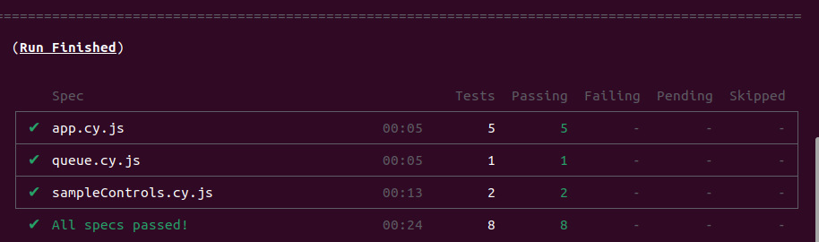
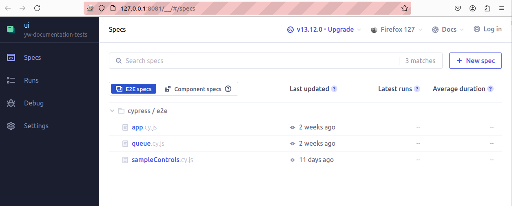
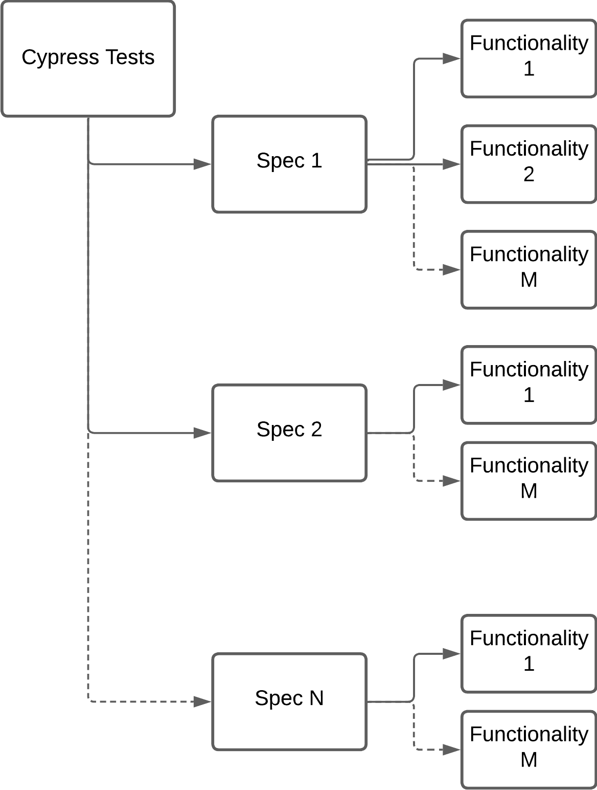

# Automated Testing

Testing is a crucial aspect of software development that ensures the reliability, quality, and performance of an application. Additionally, testing facilitates better code design and architecture by encouraging modular and decoupled code. Hence, this document will focus on the different testing frameworks used in this project, explain how to correctly use them and how to contribute to the testing environment.

The tests in this project include two different frameworks, namely [pytest](https://pytest.org/) and [cypress](https://www.cypress.io). The focus of both testing frameworks is slightly different:

- `pytest` focuses on testing Python code. In the case of MXCuBE-Web the Python code is the back-end server side of the application
- `cypress` is used for e2e tests. These tests should cover the application's workflow from the user's perspective. They simulate user interaction with the application's interface and ensure the correct functionality of features, integration of components, and overall user experience.

## Prerequirements

Running tests requires the [Redis](https://redis.io/) server to be running.

The [environment](./environment.md) document has more information about setting up a development environment for running tests.

## Pytest

The tests are located in the test folder and are executed with `pytest` command.

```
# Run pytest in the root of the mxcubeweb directory
cd mxcubeweb
pytest
```

The output should be similar to the following:


## E2E Tests (Cypress)

The end-to-end tests are located in the `ui/cypress/e2e` folder and organised into multiple spec files by feature.

To run all the tests consecutively in a headless browser environment, start both the backend and front-end servers in separate terminals, and then run the following command from the root of the project:

```
pnpm --prefix ui e2e
```

This should give you a result similar to this:



The default browser for this process is chosen to be [Firefox](https://www.mozilla.org/en-US/firefox/new/).

Another possibility is to use the [Cypress App](https://www.cypress.io/app) to run the tests. This gives you some additional possibilities such as choosing the browser environment, run only specific specs or using an interactive debugging mode. To run the Cypress App, run the following command:

```
pnpm --prefix ui cypress
```



If you'd like to run Cypress against the front-end production build of MXCuBE-Web, like in the CI, run the following:

```
pnpm --prefix ui build
CYPRESS_BASE_URL="http://127.0.0.1:8081" pnpm --prefix ui e2e
```

### Best Practices

The best use for development would be to test the components you changed first individually by using the cypress app. This allows for better error tracking and time efficiency as it prevents you from running tests on components that are not effected by your changes multiple times during development.

Once all specs concerning the changed components passed the tests, please make sure to pass every test in the headless browser environment at least once **before** you push your changes. ([Github Actions](https://github.com/features/actions) will run this command during a pull request and will block your changes from merging if they fail the tests)

How to run the cypress app and the headless browser environment is explained in the previous section.

**Only** if necessary make changes to existing tests. In case, your changes include the conceptual change on how users might perform certain actions or the changes of element name/inner texts you are allowed to change the tests. (Please make sure, that these changes are reasonable)

### Troubleshooting

This section includes a few possible scenarios on why your tests may be failing, please read through them, as this might save you some valuable time.

The first thing you should do, when failing a test is to re-run it. This solution might sound simple but failing a test case, does not necessary mean, that your code is wrong and other factors might play a role in it.

When the re-run did not help, try to switch the testing browser, you can do so by using the cypress app. However, please make sure that your code works with most browsers, especially with chrome and firefox.

It is important to notice that cypress will not test in full-screen mode, please make sure, that buttons and other elements stay visible and clickable in smaller test-windows.

The cypress tests are configured to act according to human behavior, hence during testing, certain button names or texts are looked instead of element attributes. If for a reasonable argument, your code adjustments change these names, please make sure to change the tests accordingly.

**Very important**: If you are using the development server while simultaneously running tests, do not take control (for mounting samples, running queue, ...) on the development server. This might result in tests failing, because they needed to access a certain resource, that is not accessible in _Observer mode_.

### Contributing

Contribution to the testing environment is always welcomed and appreciated. To do so please follow a few simple guidelines:

- Follow the test structure and add your tests to the corresponding spec or add a spec if necessary
  
  The current structure envisages to use one spec for every larger component in the project, for example the queue or the sample controls field. Each spec then contains smaller group of tests for each functionality, this could be the 3-click-centring method of the sample control field or the login feature for instance. Each group of tests is restricted by the same `beforEach` and `afterEach` part which can help to prepare for everything that is needed for the tests (i.e. navigating to the correct page, remove observer mode, etc...)
- Use an approach that simulates human behavior. This includes the preference of using function like `cy.findByText` or `cy.findByRole` over functions like `cy.get` (Use the latter only when there is no other possibility) as well as using a clicking procedure rather than using the api directly.
- Make sure that your tests do not run in _Observer mode_ when accessing elements by using `cy.takeControl()`. Your test might not run in _Observer mode_ when called seperately, but when running in a spec of a few tests, this might be possible.
- To keep the codebase tidy, you can add auxiliary functions in `ui/cypress/support.js`. These commands are used for clicking procedures that will be repeated by many different tests for example login, or sample mounting. Feel free to add necessary helper functions and check out the current commands.
