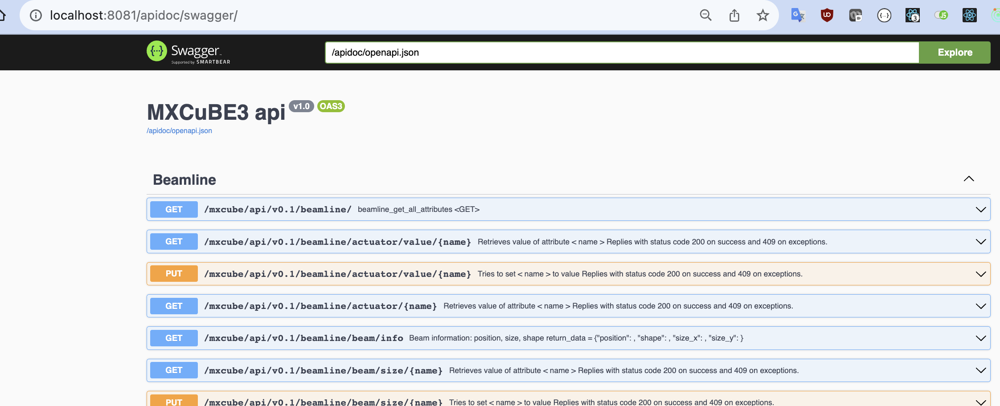
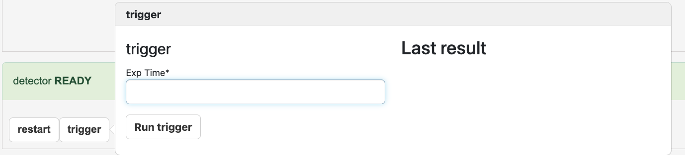
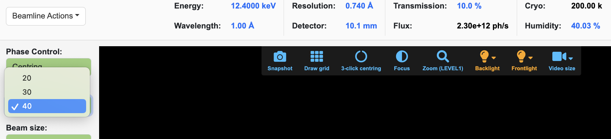

# Development tutorial

## Exercise 1: Setup environment

Launch the web UI, sign in, and play...

Useful links:

- React Developer Tools: [installation](https://chrome.google.com/webstore/detail/react-developer-tools/fmkadmapgofadopljbjfkapdkoienihi) and [usage](https://react.dev/learn/react-developer-tools)
- Redux DevTools: [installation](https://chrome.google.com/webstore/detail/redux-devtools/lmhkpmbekcpmknklioeibfkpmmfibljd) and [usage](https://github.com/reduxjs/redux-devtools)
- Swagger link once `mxcubeweb` is running: <http://localhost:8081/apidoc/swagger/>




## Exercise 2: Create a new beamline action and trigger it from the UI

For procedures that are frequently used and involve more than a simple command.
Try it out, play with multiple hardware objects.


### Solution

Edit the XML so MXCuBE is aware of the new action:

```xml
<object class="BeamlineActionsMockup">
    <commands>[
        {"type": "controller", "name": "SuperAction", "command": "HardwareObjects.mockup.BeamlineActionsMockup.SuperAction"},
        ...
    ]
    </commands>
</object>
```

And implement the actual action in `mxcubecore/mxcubecore/HardwareObjects/mockup/BeamlineActionsMockup.py`:

```python
class SuperAction:
    def __call__(self, *args, **kw):
        logging.getLogger('HWR').info("Running super action")

        from mxcubecore import HardwareRepository as HWR
        logging.getLogger('HWR').info("Setting diff to transfer")

        HWR.beamline.diffractometer.set_phase('Transfer')
        gevent.sleep(3)
        logging.getLogger('HWR').info("Restarting detector")

        HWR.beamline.detector.restart()
        logging.getLogger('HWR').info("Running super action")
```


## Exercise 3: Add a custom action for the detector and make it appear in the UI (custom equipment tab)

For not so often used or temporary instrumentation commands




### Solution

We add the method to the hardware object:

```python
    def trigger(self, exp_time: float ) -> None:
        self.update_state(HardwareObjectState.BUSY)
        time.sleep(exp_time)
        self.update_state(HardwareObjectState.READY)
```

and define as exportable in the detector.xml

```xml
  <exports>["restart", "trigger"]</exports>
```


## Exercise 4: Humidity controller

- Create a new hardware object that emulates a humidity controller:
  it emits periodically an updated value, and the reference value can be changed
- Display this value in the sample view area
- The UI can control the reference




### Solution

First, we need to write the hardware object:

```python
"""
[Name] Humidity Controller

[Description]
Humidity Controller Mockup

[Emited signals]
valueChanged

"""

import random
import gevent
from mxcubecore.HardwareObjects.abstract import AbstractActuator


class HumidityControllerMockup(AbstractActuator.AbstractActuator):
    """HumidityControllerMockup implementation"""

    def __init__(self, name):
        super().__init__(name)

    def init(self):
        """Initialisation method"""
        super().init()
        self._nominal_value = 33.3
        # self.humidity_list = self.get_property('humidity_list', None)
        self.update_state(self.STATES.READY)
        self._run()

    def _run(self):
        """Spawn update routine."""
        gevent.spawn(self._update)

    def get_value(self):
        """Read the humidity.
        Returns:
            float: humidity value.
        """
        # _nominal_value comes from AbstractActuator
        noise = random.random()
        return self._nominal_value + noise

    def set_value(self, value, timeout=0):
        """Set humidity reference.
        Args:
            value: target value
            timeout (float): optional - timeout [s],
                             If timeout == 0: return at once and do not wait
                                              (default);
                             if timeout is None: wait forever.
        Raises:
            ValueError: Invalid value or attemp to set read only actuator.
            RuntimeError: Timeout waiting for status ready  # From wait_ready
        """
        print('set_value')
        self._nominal_value = value
        return self.get_value()

    def get_humidity_list(self):
        return self.humidity_list

    def _update(self):
        while True:
            gevent.sleep(5)
            value = self.get_value()
            print('new humidity value {}'.format(value))
            self.emit("valueChanged", (value,))

```

with the `humidity.xml`:

```xml
<object class="HumidityControllerMockup">
</object>
```

and an extra line in `mxcubeweb/demo/beamline_config.yml`:

```yaml
    - humidity: humidity.xml
```

And we need to let the beamline class know about it:

`Beamline.py`

```python
    @property
    def humidity(self):
        """Humidity control Hardware object

        Returns:
            Optional[AbstractMachineInfo]:
        """
        return self._objects.get("humidity")

    __content_roles.append("humidity")
```

And finally, let the UI know that there is a new hardware object that needs rendering.

In `ui.yaml`:

```yaml
    - label: Humidity
      attribute: humidity
      precision: 2
      suffix: "%"
      format: expo
```

This made the UI provide the functionality out of the box,
but we did not really play with web development.
The extra dropdown menu gives us some extra knowledge.

First, we need to create the React component.
Create the new file `mxcubeweb/ui/src/components/SampleView/HumidityInput.js`:

```jsx
import React from 'react';
import '../MotorInput/motor.css';
import '../input.css';
import cx from 'classnames';

export default class HumidityInput extends React.Component {
  constructor(props) {
    super(props);
    this.sendHumidity = this.sendHumidity.bind(this);
    this.humidityList = [20, 30, 40];
  }

  sendHumidity(event) {
    if (event.target.value !== 'Unknown') {
      this.props.sendHumidity(event.target.value);
    }
  }

  render() {
    const inputCSS = cx('form-control input-sm', {
      'input-bg-moving': this.props.state !== 'READY',
      'input-bg-ready': this.props.state === 'READY',
    });

    console.log('render humidity', this.props);
    return (
      <div className="motor-input-container">
        <select
          className={inputCSS}
          onChange={this.sendHumidity}
          value={this.props.humidity}
        >
          {this.humidityList.map((option) => (
            <option key={option} value={option}>
              {option}
            </option>
          ))}
        </select>
      </div>
    );
  }
}
```

You can see that we are hard-coding the options for the humidity.
Now we need to call this component in `mxcubeweb/ui/src/containers/SampleViewContainer.js`

```jsx
import HumidityInput from '../components/SampleView/HumidityInput';

// and
    const humidityInput = (
      <div>
        <p className="motor-name">Humidity Control:</p>
        <HumidityInput
          humidityList={this.props.sampleViewState.humidityList}
          sendHumidity={this.props.sampleViewActions.sendHumidity}
          state={diffractometerHo.state}
        />
      </div>
    );

// and
              {process.env.REACT_APP_PHASECONTROL === 'true'
                ? phaseControl
                : null}
              {humidityInput}
          {apertureControl}
```

Just find your way through the code. ;)

We still need to define what happens when we select an option.
`sendHumidity` would be called...
if we had created it first in `mxcubeweb/ui/src/actions/sampleview.js`:

```jsx
export function sendHumidity(humidity) {
  return function () {
    fetch('/mxcube/api/v0.1/beamline/actuator/value/humidity', {
      method: 'PUT',
      credentials: 'include',
      headers: {
        Accept: 'application/json',
        'Content-type': 'application/json',
      },
      body: JSON.stringify({ name: 'humidity', value: humidity }),
    });
  };
}
```


## Exercise 5: New React component from scratch

This shows how to create and use a minimal component.
Don't pay too much attention to the functionality.

```jsx
import React from 'react';
import { Button } from 'react-bootstrap';

function NewComponent(props) {
  return (
    <div>
      <Button
        variant="danger"
        onClick={() => props.sendCurrentPhase('Transfer')}
      >
        boo
      </Button>
      <h1>Hello, {props.name}</h1>
    </div>
  );
}

export default NewComponent;
```

And in `BeamlineSetupContainer.jsx` add the following lines:

```jsx
import NewComponent from '../components/NewComponent/NewComponent';

// in the render method:

          <Nav className="me-3">
            <NewComponent
              name={
                this.props.beamline.hardwareObjects['diffractometer.phi'].value
              }
              sendCurrentPhase={this.props.sampleViewActions.sendCurrentPhase}
            />
```
